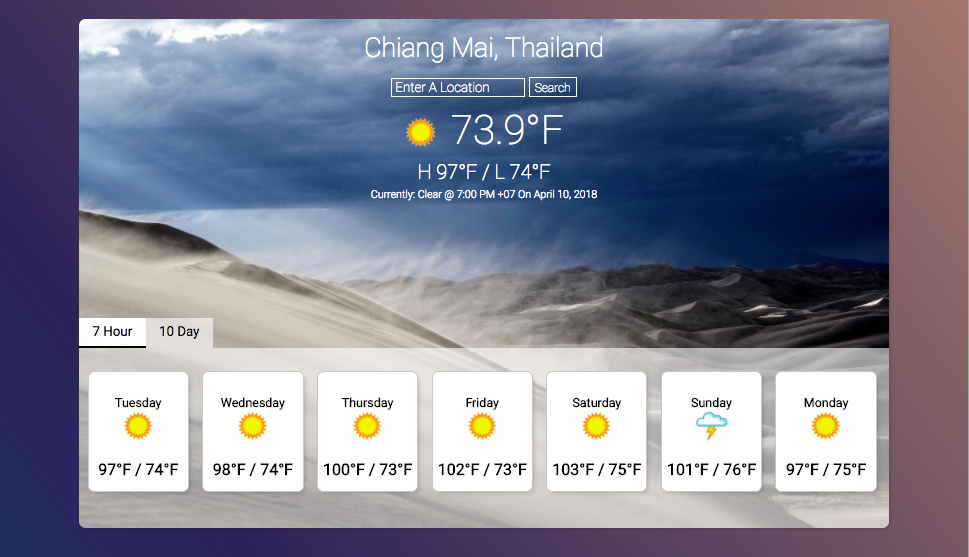

# Weatherly

## About:

This app utilizes the Weather Underground API in order to render weather data for a specific location.

## Tech Stack:

JavaScript, React/Redux, Chai, CSS

## Set Up:

1. Clone repo
2. `npm install`
3. To start server: `npm start`
4. To run tests: `npm test`

